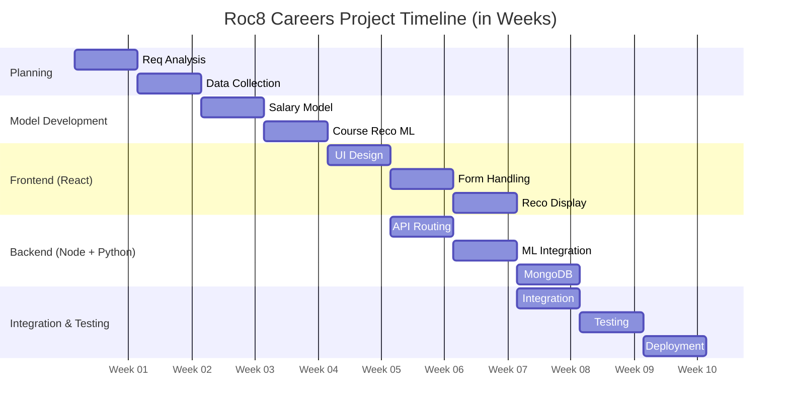

```mermaid
gantt
    title Roc8 Careers Project Timeline (in Weeks)
    dateFormat  YYYY-MM-DD
    axisFormat  Week %W

    section Planning
    Req Analysis            :task1, 2024-01-01, 1w
    Data Collection         :task2, after task1, 1w

    section Model Development
    Salary Model            :task3, after task2, 1w
    Course Reco ML          :task4, after task3, 1w

    section Frontend (React)
    UI Design               :task5, after task4, 1w
    Form Handling           :task6, after task5, 1w
    Reco Display            :task7, after task6, 1w

    section Backend (Node + Python)
    API Routing             :task8, after task5, 1w
    ML Integration          :task9, after task8, 1w
    MongoDB                 :task10, after task9, 1w

    section Integration & Testing
    Integration             :task11, after task7, 1w
    Testing                 :task12, after task11, 1w
    Deployment              :task13, after task12, 1w


```